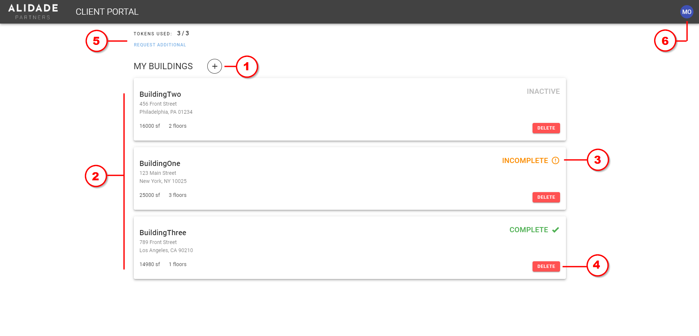
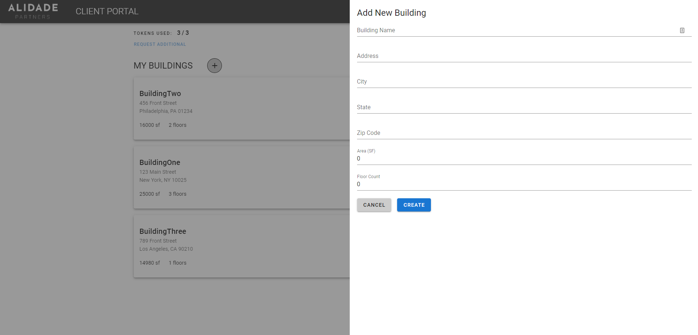
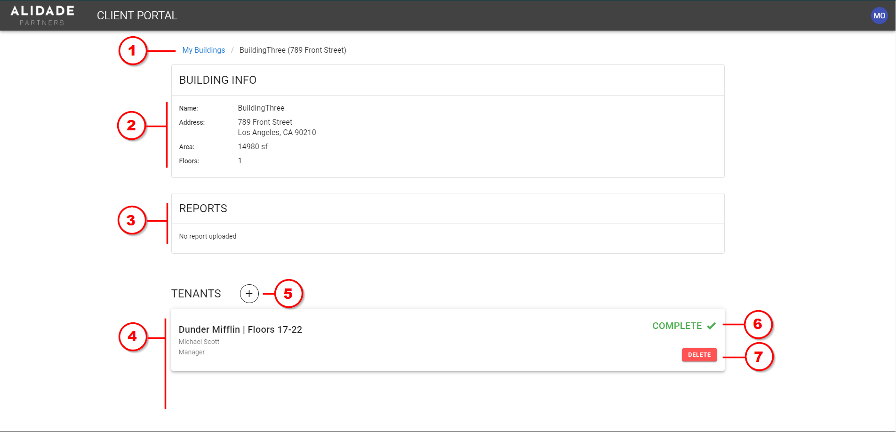
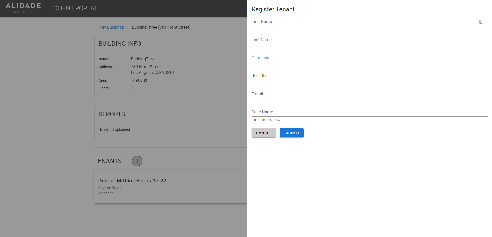
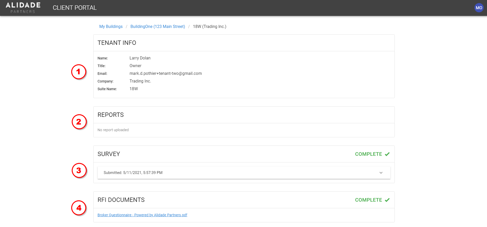
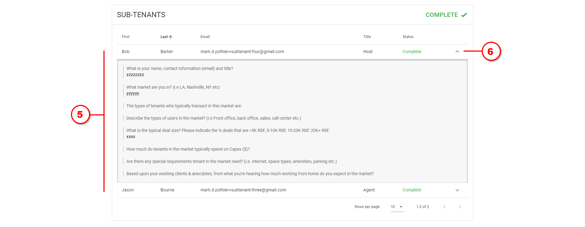

# Master Client User Guide

The following instructions are intenteded to help guide master clients to sign up to the portal, manage buildings, register tenants, view tenant data, and view reports.

## Sign Up

1. You will receive an email from "Alidade Client Portal" containing a link to the sign-up page
2. On the sign-up page, your email will be pre-filled; adjust your name as needed, and create a password which you will use each time to login.
3. Click "Sign Up"

## Manage Buildings

Upon logging in, you will see a dashboard showing information about any buildings you have configured in the portal. The following image illustrates the features and functionality available to you:

1. **Add a building** - a form will appear enabling you to set basic information about a building, including name, address, floor area, and floor count.

    

2. **List of your buildings** - buildings you have created will appear here. Click on a building card to [manage its tenants](#manage-tenants)

3. **Building information status** - the status shown here indicates the completeness of information submitted for all dependencies of the building, including all tenant and subtenant information (e.g. surveys, floor plans):
    - `Inactive` - No tenants have been configured for the building
    - `Incomplete` - One or more tenants (or their subtenants) have not completed their required information
    - `Complete` - All building tenants and subtenants have completed their required information

4. **Delete building** - deletes this building, including all dependencies (e.g. tenants, survey data, file uploads). This action cannot be undone.

5. **Token usage** - a token quota determines the number of tenants a master client is able to register across their buildings. If additional tenants need to be registered and added to buildings, click "Request Additional", and the request will be sent to Alidade to increase the token quota limit.

6. **Profile** - clicking the bubble with your initials will open a dropdown menu showing your email name and email address, as well as a `Logout` button.

## Manage Building Tenants

Clicking on a building card on the home page will bring you to a building page:

1. **Navigate**  - go back to the home page by clicking "My Buildings"

2. **Building information** - basic building info

3. **Reports** - when available, building composition reports will appear here for you to view

4. **List of building tenants** - tenants that you have registered for this building will appear here. Click on a tenant card to [view tenant submission data](#view-tenant-submission-data)

5. **Add a tenant** - a form will appear enabling you to register a new tenant and identify the associated suite they will occupy within the building. Upon registering the tenant, they will receive an email enabling them to sign up, log into the portal, and complete their required information. The number of tenants you can register (total across all buildings) is limited by the token quota on the home page.

    

6. **Tenant information status** - the status shown here indicates the completeness of information submitted by the tenant and their subtenants, including surveys and RFI files:
    - `Incomplete` - Tenant has not registered any subtenants, OR one or more of the tenant and subtenants has not completed the survey, OR the tenant has not uploaded any RFI (PDF) documents
    - `Complete` - The tenant's required information has been completed and uploaded.

7. **Delete tenant** - deletes this tenant from the building, including all dependencies (e.g. subtenants, survey data, file uploads). This action cannot be undone.

## View Tenant Submission Data

Clicking on a tenant card on the home page will bring you to a tenant page:

1. **Tenant information** - basic tenant info

2. **Reports** - when available, tenant composition reports will appear here for you to view

3. **Tenant survey** - once completed, the tenant's survey responses will appear here for you to view when clicking the dropdown button

4. **RFI Documents** - once uploaded the tenant's RFI response documents (e.g. PDF floor plans) will appear here for you to view and download

5. **List of subtenants** - a list of subtenants that have been registered by the main tenant; note that the status (i.e. `Incomplete` vs. `Complete`) will appear as `Complete` when one or more subtenants have been registered, and all registered subtenants have completed the survey

6. **Subtenant survey responses** - once completed, the subtenant's survey response can be viewed by clicking the dropdown button