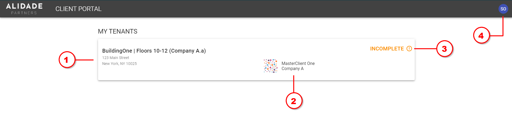
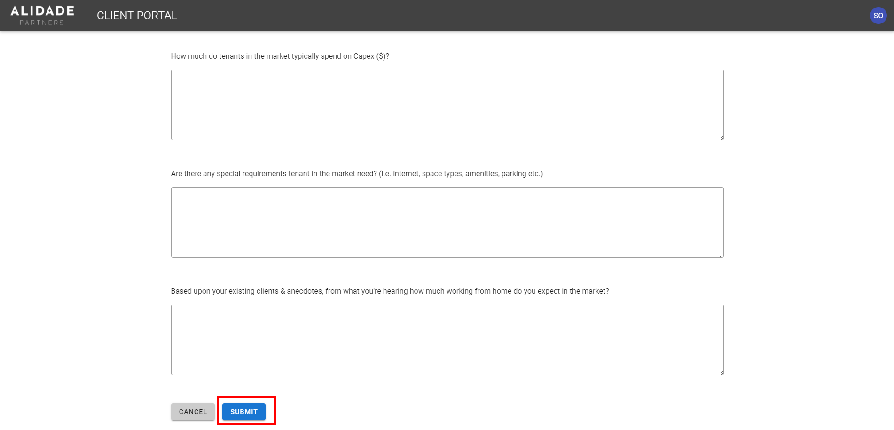

# Subtenant User Guide

The following instructions are intenteded to help guide subtenants to sign up to the portal and complete the required survey.

## Sign Up

1. You will receive an email from "Alidade Client Portal" containing a link to the sign-up page
2. On the sign-up page, your email will be pre-filled; adjust your name as needed, and create a password which you will use each time to login.
3. Click "Sign Up"

## Survey

Upon logging in, you will see a dashboard showing information about any buildings you have been added to as a subtenant, and which require your survey response:

1. **Building and suite** - basic information about the building, including address and your suite/floor number. **Click on the card to complete the [survey form](#survey-form)**

2. **Master client** - name and company of your tenant's registrar

3. **Subtenant information status** - the status shown here indicates the whether or not your have completed the survey form

4. **Profile** - clicking the bubble with your initials will open a dropdown menu showing your email name and email address, as well as a `Logout` button.

## Survey Form

After clicking on the building card, you will be brought to the survey page. Respond to the questions to the best of your ability, including all required responses.

When finished, click the "Submit" button at the bottom of the form.

