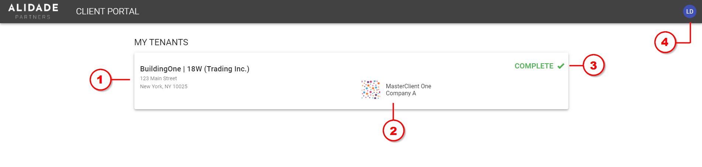
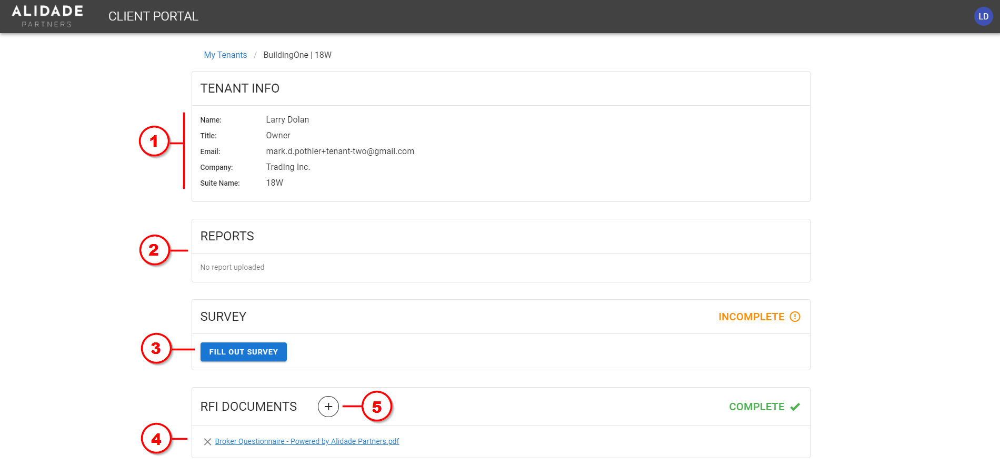
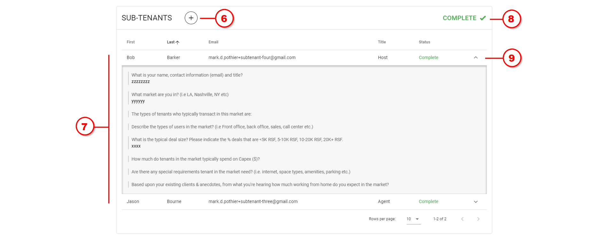
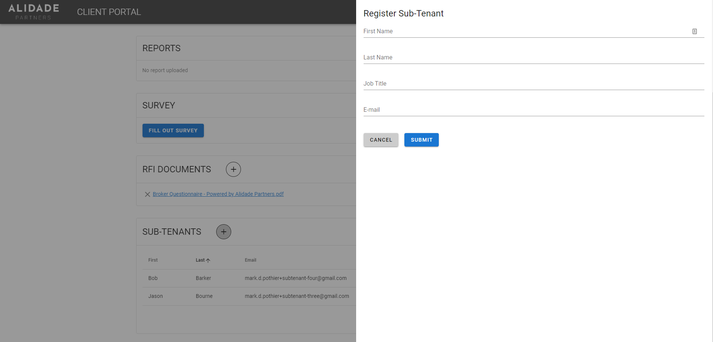

# Tenant User Guide

The following instructions are intenteded to help guide tenants to sign up to the portal, submit required information, register subtenants, and view reports.

## Sign Up

1. You will receive an email from "Alidade Client Portal" containing a link to the sign-up page
2. On the sign-up page, your email will be pre-filled; adjust your name as needed, and create a password which you will use each time to login.
3. Click "Sign Up"

## Locations

Upon logging in, you will see a dashboard showing information about any buildings you have been added to as a tenant:

1. **Building and suite** - basic information about the building, including address and your suite/floor number. Click on the card to view and manage its [information and details page](#manage-tenant-information)

2. **Master client** - name and company of your registrar

3. **Tenant information status** - the status shown here indicates the completeness of information submitted by you as the tenant, as well as your subtenants, including surveys and RFI files:
    - `Incomplete` - You have not registered any subtenants, OR one or more of you and your subtenants has not completed the survey, OR you have not uploaded any RFI (PDF) documents
    - `Complete` - You have complete all required information.

4. **Profile** - clicking the bubble with your initials will open a dropdown menu showing your email name and email address, as well as a `Logout` button.

## Manage Tenant Information

Clicking on a building card will bring you to your tenant information page:

1. **Tenant information** - basic tenant info

2. **Reports** - when available, tenant composition reports will appear here for you to view

3. **Tenant survey** - click the "Fill Out Survey" button to complete and submit required survey responses. Once completed, you will be able to view your responses in a dropdown

4. **RFI Documents** - Files you have uploaded will appear here for you to view and download

5. **Upload documents** - Upload one or more PDF files, including recent floor plans (ideally with furniture) 

6. **Add subtenants** - Add and register one or more subtenants. Clicking this button will open a registration form. Upon being registered, the subtenant will receive an email with instructions to sign up, log in to the portal, and complete the survey.

    

7. **List of subtenants** - a list of subtenants you have registered

8. **Subtenants overall status** - the status (i.e. `Incomplete` vs. `Complete`) will appear as `Complete` when one or more subtenants have been registered, and all registered subtenants have completed the survey

9. **Subtenant survey responses** - once completed, the subtenant's survey response can be viewed by clicking the dropdown button